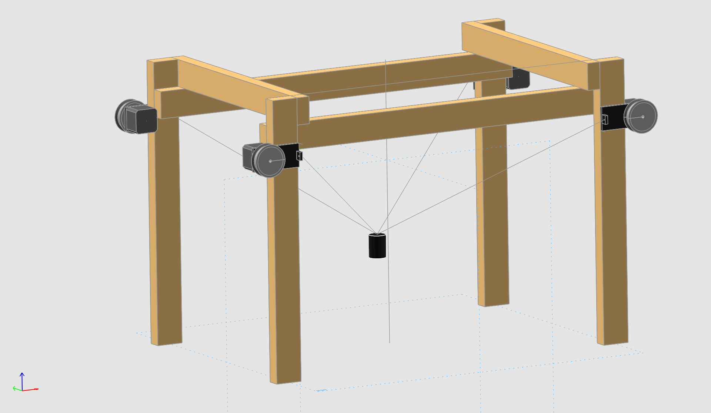

# Spider robot

Controller for a spider-cam-like positioner (cable suspended robot).

### Author
Niklas Beuster -- niklas.beuster@tu-ilmenau.de

## Description
This project provides a system to build the presentation of a cable suspended robot with arbitrary cables.
It cares about the calculation of the cable lengths and rotation speeds for each winch when moving the platform to a new target position.
The motors need a serial interface to send them rotation rate and rotation position at minimum.



## How to install
Clone this repository somewhere to the host computer that will control your devices.
In the newly created directory, install the package with: `pip install .`

Now, you can import **spiderrobot** from anywhere on that computer in python.

## Usage
1. Define a coordinate system in the real world for the application, i.e. where the target is moving in and the motor axes are placed.
2. Instantiate the [Positioner](spiderrobot/positioner) class with the serial interface for the motor controller and the initial target position.
3. Add motor abstractions using the "addAxis" method with the motor id, position of the axis and the axle diameter in meters.
4. Move the target using the "moveToPos([x, y, z], velocity)" method, with argumements being metric.

**Note:**

The system is only valid constrained on a point, but not between two points!
When the next target position is very far away from the last position, use "moveOnLine([x, y, z], velocity, 0.0, resolution)" instead of "moveToPos".
The robot will then split the line into intermediate points between the last and target position.
A resolution of 0.1 m is often good enough.

#### Example

```python
from spiderrobot import Positioner
import sys

# parse start position
pos = [float(a) for a in sys.argv[1].split(',')] if len(sys.argv) > 0 else [0.0, 0.0, 0.05]

# initialize positioner with initial target position
p = Positioner('/dev/tty.usbserial-A50285BI', pos)

# add axes with their positions
nomX = 2.5-0.048 # nominal x length from origin
nomY = 1.25+0.013 # nominal y length from origin
nomZ = 2.5-0.1 # nominal z length from origin
p.addAxis(1, [nomX, nomY, nomZ])
p.addAxis(2, [-nomX, nomY, nomZ])
p.addAxis(3, [-nomX, -nomY, nomZ])
p.addAxis(4, [nomX, -nomY, nomZ])

# move a simple pattern: up, then down
p.moveToPos([0.0, 0.0, 0.5], 0.05)
p.moveToPos([0.0, 0.0, 0.05], 0.1)
```